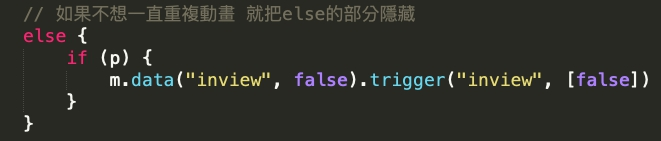
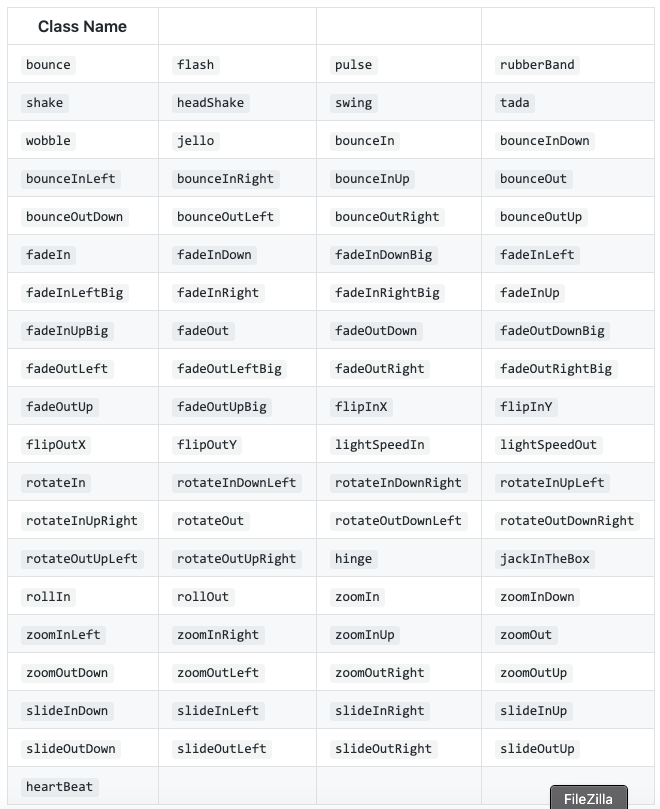
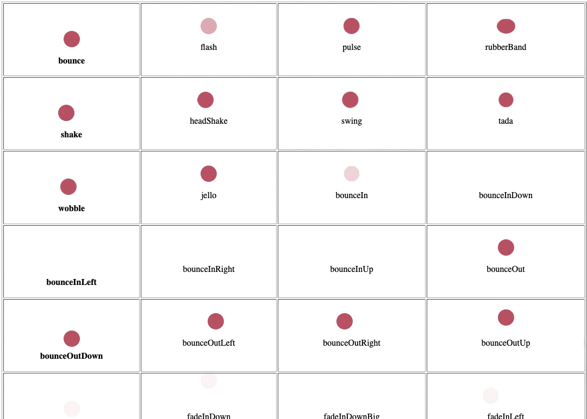
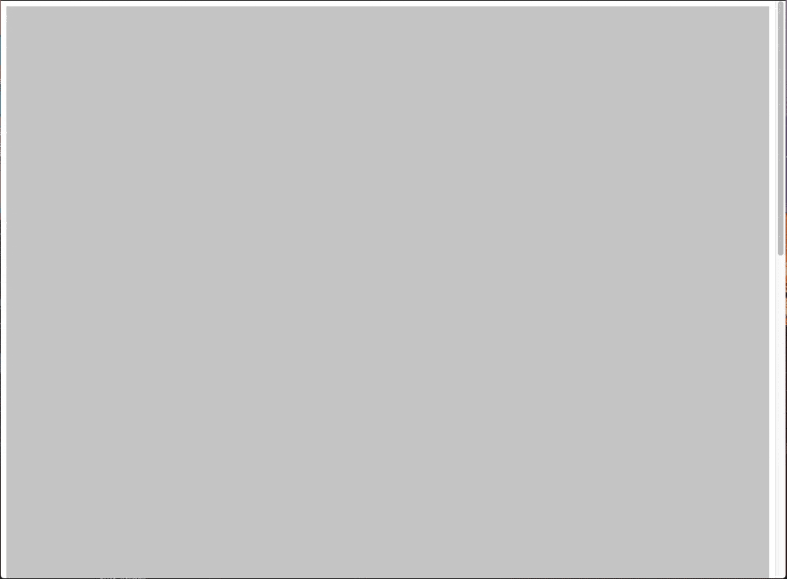

# 使用 css3 animate，秒提升網頁質感


## 一：基本款 —— 畫面scroll到元素位置後，元素滑入效果

_只要加入class即達成！<br>_
_此方式也可運用在大部分的標籤及現在很夯的svg！！
動畫手殘的人！快收藏下來吧！_

套入後效果：
   
   


快速應用方式：
```html
    <!-- 載入以下js及css -->
    <link rel="stylesheet" type="text/css" href="css/animate.css" />
	<script type="text/javascript" src="js/jquery.min.js"></script>
	<script src="js/jquery.inview.js"></script>
    <script src="js/animate.js"></script>

	<!-- 針對想加入效果的元素加上class，效果已寫在css裏頭，如有需求可自行增加變化 -->
	<!-- 由下往上淡入效果 -->
	<!-- 由右往左淡入效果 -->
	<!-- 由左往右淡入效果 -->
```
若不想一直不停重複滑入動畫效果，可以改“jquery.inview.js”，約101行的部分，這部分也有註記！
   
   

*  [範例](http://www.milky-sky.com/brangista/animateShare/Basic/index.html)  

* * *

## 二：animate.css 動畫模組：元素各種彈跳及動畫樣式 

_Animate.css 為我們預建了 75 種不同的動態效果，我們只要透過設定 Class 的方式使用即可！<br>_


   

   圖為部分截圖
   
快速應用方式：
```html
   <!-- 載入以下js及css -->
   <link rel="stylesheet" type="text/css" href="animate.css"/>

   <!-- 針對想加入效果的元素加上class -->
   <div class="circle animated flash infinite"></div>

   <!-- class註解 -->
   animated: 啟用動畫
   flash:    彈跳效果
   infinite: 無限循環

   <!-- 或是利用 CSS3 的屬性來調整動畫的次數與速度 -->
   <div class="circle animated bounce" style="animation-duration: 5s;animation-iteration-count:3"></div>	
   <!-- 上面這個寫法會讓元素以每次 5 秒的速度重覆彈跳 3 次 -->	  
```

*  [animate.css 範例](http://www.milky-sky.com/brangista/animateShare/animateCSS01/animateCSS.html)<br>
  
*  [原套件官網](https://daneden.github.io/animate.css/)<br>

_以上的方式常在日式網頁上常常看到，在範例中用圓點的樣式看起來可能不怎麼樣，但若套用到更可愛的圖案元素上，就更有感了！<br><br>以下提供可愛元素的範例：_

圖為部分截圖
   

*  [loading.css 範例(和上方的範例部分效果不同)](http://www.milky-sky.com/brangista/animateShare/animateCSS02/animateCSS.html)  

*  [原套件官網](https://loading.io/animation/)<br>

*  [試套結果](http://www.milky-sky.com/brangista/NBBigMacTest/)  


* * *


## 三：WOW.js-offset像素(offset觸發一次性動畫)

_WOW.js依賴animate.css，所以它支持animate.css多達60多種的動畫效果，能滿足您的各種需求。<br>_
*  [原套件官網](https://wowjs.uk)<br><br>
_瀏覽器兼容:<br>
windows：IE10以上,edge,chrome,firefox<br>
mac：safari,edge,chrome,firefox_

   

快速應用方式：
```html
   <!-- 載入以下css及js -->
   <link rel="stylesheet" href="animate.css">
   <script src="wow.js"></script>

   <script>
      var wow = new WOW({
         boxClass: 'wow', // 要套用WOW.js縮需要的動畫class(預設是wow)
         animateClass: 'animated', // 要"動起來"的動畫(預設是animated, 因此如果你有其他動畫library要使用也可以在這裡調整)
         offset: 200, // 元素的位置露出後距離"底部"多少像素執行 (預設是0px，無法使用％)
         mobile: true, // 手機上是否要套用動畫 (預設是true)
         live: true, // 非同步產生的內容是否也要套用 (預設是true, 非常適合搭配SPA)
         callback: function(box) {
            // 當每個要開始時, 呼叫這裡面的內容, 參數是要開始進行動畫特效的element DOM
         },
         scrollContainer: null // 可以設定成只套用在某個container中捲動才呈現, 不設定就是整個視窗
      });
      wow.init();
   </script>

   <!-- html_針對想加入動畫的元素寫入class，.wow及動畫效果class必加 -->
   <section class="wow bounce">2</section>
    
```

*  [範例](http://www.milky-sky.com/brangista/animateShare/offsetValue/)
<br>
範例中的offset，僅能使用實際數值（px），無法使用％<br><br>
另外，可搭配的效果如下：<br>
_data-wow-duration（動畫持續時間）<br>
data-wow-delay（動畫延遲時間）<br>
data-wow-offset（元素的位置露出後距離底部多少像素執行<br>
data-wow-iteration（動畫執行次數）(要一直重複的話可以用"infinite")_

```html
   <section class="wow bounce" data-wow-offset="10" data-wow-iteration="10">測試</section>
    
```


* * *


## 四：wayPoints.js-offset像素及%(offset觸發重複性動畫)

快速應用方式：
```html
   <!-- 載入animate css -->
   <link rel="stylesheet" href="./css/animate.css">

   <!-- jquery.js library -->
   <script src="./js/jquery-1.12.4.min.js"></script>

   <!-- waypoint.js library -->
   <script src="./js/noframework.waypoints.min.js"></script>

   <!-- html_針對想加入動畫的元素寫入class -->
   <section class="infomation" id="infomation" style="margin-top: 500px; height: 500px; background-color: blueviolet;">
      <div id="openDate">6/17 創新募集</div>
   </section>
   <section class="infomation" id="infomation02" style="height: 500px; background-color: red;">
      <div id="openDate02">6/20 test</div>
   </section>

  <!-- script -->
   <script>
      $(document).ready(function () {
         // use waypoint.js library whith title enter screen
         function animateCSS(element, animationName, callback) {
         var node = document.querySelector(element)
         node.classList.add('animated', animationName, "faster")

         function handleAnimationEnd() {
            node.classList.remove('animated', animationName)
            node.removeEventListener('animationend', handleAnimationEnd)

            // 如果有傳入 callback function 時執行
            if (typeof callback === 'function') callback()
         }
         node.addEventListener('animationend', handleAnimationEnd)
         };

         // 紫色區域(想增加的動畫，主要是加這裡)
         var openDate = new Waypoint({
         element: document.getElementById('infomation'),
         handler: function (direction) {
            // 呼叫共用函式 animateCSS()
            animateCSS('#openDate', 'bounce');
            //bounce為動畫效果，可自行定義
         },
         offset: "50%" //元素距離視窗頂部
         });

         // 紅色區域(想增加的動畫，主要是加這裡)
         var openDate = new Waypoint({
         element: document.getElementById('infomation02'),
         handler: function (direction) {
            // 呼叫共用函式 animateCSS()
            animateCSS('#openDate02', 'bounce');
            //bounce為動畫效果，可自行定義
         },
         offset: "50%" //元素距離視窗頂部
         });
      });
   </script>
    
```
offset可為％或是px: "50%" or 200
*  [範例](http://www.milky-sky.com/brangista/animateShare/animator/)
